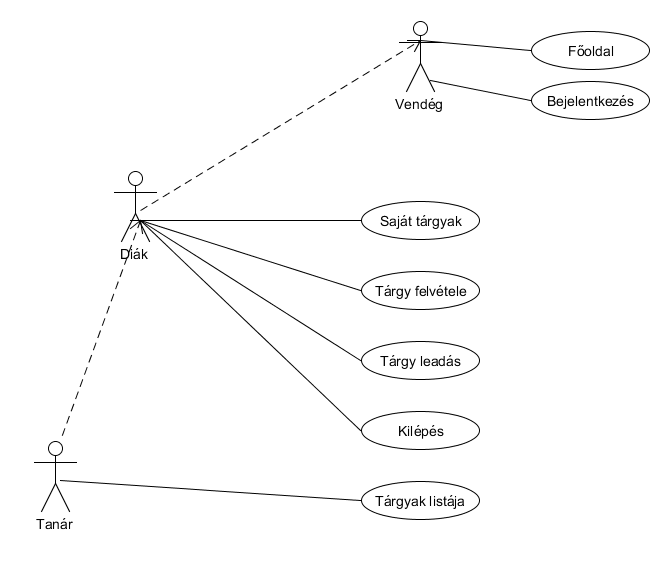
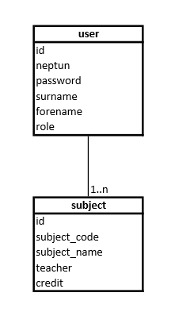

#Alkalmazások fejlesztése 1. beadandó - Tárgyfelvétel

##Követelményanalízis
A feladat egy alkalmazás létrehozása, melyben a felhasználók bejelentkezés után kezelhetik tárgyaikat. A legelső bejelentkezés előtt a felhasználóknak regisztrálniuk kell, ahol kiválaszthatják, hogy tanárként vagy diákként regisztrálnak. A tanárok belépés után látják az összes tárgyat és törölni is tudják őket, míg a diákok csak a saját maguk által felvett tárgyaikat látják, hozzáadhatnak újat és törölhetnek a meglévők közül.

##Tervezés
###Adatmodell
A **user** tábla tartalmazza a felhasználók adatait:
  - Neptun kód
  - Jelszó
  - Név
  - Felhasználó típusa:
    + Tanár
    + Diák
  
A **subject** tábla tartalmazza a tárgyak adatait:
  - Tárgy kódja
  - Tárgy neve
  - Kredit
  

###Oldaltérkép
* Publikus:
	- Főoldal
	- Bejelentkezés
* Diák
	- Főoldal
	- Bejelentkezés/kijelentkezés
	- Tárgylista
		  + tárgy felvétel
		  + tárgy leadás
* Tanár
	- Főoldal
	- Bejelentkezés/kijelentkezés
	- Tárgylista
		+ tárgy törlése

##Végpontok
A következő lista tartalmazza az egyes végpontokon elérhető funkciókat

* GET /: főoldal
* GET /login: bejelentkező oldal
* POST /login: bejelentkezési adatok felküldése
* GET /subjects/list: saját(tanár esetén összes) tárgylista oldal
* GET /subjects/new: új tárgy felvétele
* POST /subjects/new: új tárgy felvétele, adatok küldése
* POST /subjects/list: tárgyak leadása

##Implementáció
A program elkészítéséhez a *Cloud9 IDE*-t használtam, ami egy online felhő alapú fejlesztőkörnyezet rengeteg funkcióval.
Az alkalmazás *Javascript* nyelven készült, *Node.js*, valamint számos *3rd party* könyvtár használatával.
Néhány használt könyvtár:
- BootStrap CSS könyvtár: http://getbootstrap.com/
- Passport autentikáció: http://passportjs.org/
- WaterLine adatbázis: https://www.npmjs.com/

###Felépítés
Az alkalmazás **MVC** alapján készült, értelemszerűen a *models* mappában a modelleket, a *views* mappában a nézetet és a *controllers* mappában a vezérlőréteget megvalósító forrásállományok vannak. A **server.js** áálományt tekinthetjük az alkalmazás főprogramjának. Az adatok tárolása lokálisan történik egy *.db* kiterjesztésű fájban.

##Tesztelés
A teszteléshez a **Mocha** tesztkeretrendszert használtam (elérhető a: https://mochajs.org/ címen).
Telepítése: 
> npm install mocha --save-dev

A teszt futtatásához fel kell telepítenünk a *chai* modult is:
> npm install chai --save-dev

A tesztfájl a **models** mappában található **user.test.js** néven.
Futtatása:
> mocha models/user.test.js

A teszt a *user* modelt teszteli.

###Funkcionális teszt

A funkcionális teszteket a **Selenium IDE** *firefox* kiegészítőjével készítettem és a *test* mappában vannak.
* 1: Új felhasználó regisztrálása, létező neptun esetén hiba
* 2: Új tárgy felvétele, majd leadása
* 3: Új tanár és diák regisztrálása, a diák felvesz két tárgyat majd a tanár törli őket.

##Felhasználói dokumentáció
Az alkalmazás futtatásához **4.1.1**-es verziójú *Node* szükséges, valamint telepíteni kell különböző *node* modulokat a a **package.json** alapján.
Ehhez használhatjuk a következő parancsot:   
 > npm install --production 
 
Továbbá telepítenünk kell még a *bower*-t:
> bower install

A program elérhető a http://targyfelvetel.herokuapp.com címen
